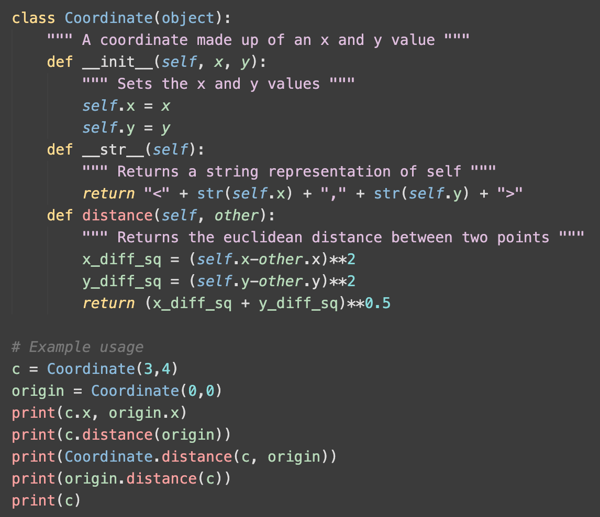

# Chalk VS Code Theme 

A VS Code theme based on the colors from chalk, the terminal styling library.

## Credits

- [chalk](https://github.com/chalk/chalk)
- [Theme Studio for VS Code](https://themes.vscode.one/)